# Smart Building Management System 

We have four entitie and created under the order Building, Rooms, Heater and Window respectively. 

- Also, I attached a vedio which explains the functionalities we implemented for your reference.Please check the "appdemovedio" folder for the vedios explanantion.

## Procedure to run the application 

We used online rest APIs for this application. and define the base url of the online api is provide in the variable.js file.

In case, if the online the version is not working, I attached the jar file of spring boot application in the folder named "backend" and also need to change the based url of the backend in the varible.js.

Note  -  Cors configuration is done at the backend side and We added the frontend end-point

### Run application 

- Step 1 -  Run "npm install"
- Step 2 -  Run "npm run serve"
- Step3  -  Go the url "http://localhost:8080/"

Already defined the port number in the vue.config.js file 

# Implemented features

- [ ] User can add new Building and display the added building information.
- [ ] User can navigate towards the added building and create room and also able to display the created rooms.
- [ ] User can able to navigate to heater and window from each room and also able create new heaters and windows.
- [ ] The created window and heater can edited and deleted.
- [ ] User can change the status of window and heater and display the changed status.
- [ ] Confirmation popup will display when delelting the heater or window and while changing the heater and window status.
- [ ] Corresponding notifications will come when creating new building and room 
- [ ] Notifcations will come when creating, editing, deleting and changing the status of windows and heater.
- [ ] Button is added in the top-left to navigate between the building and rooms and also from heater or window to rooms.

# Some images of the developed screen and functions

## Add new building 
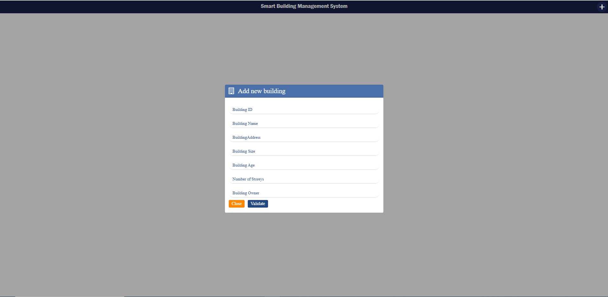

## Display added buildings and notifaction to comfirm 

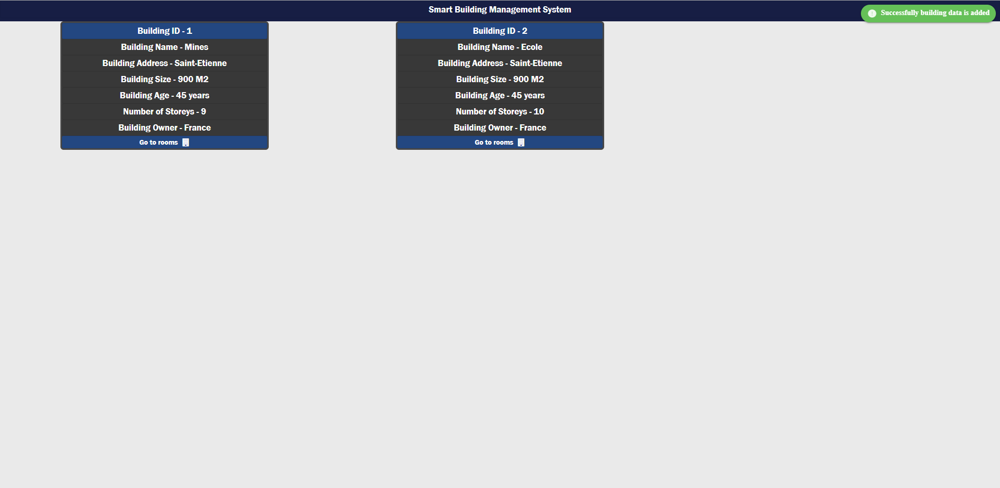

## Display four added buildings

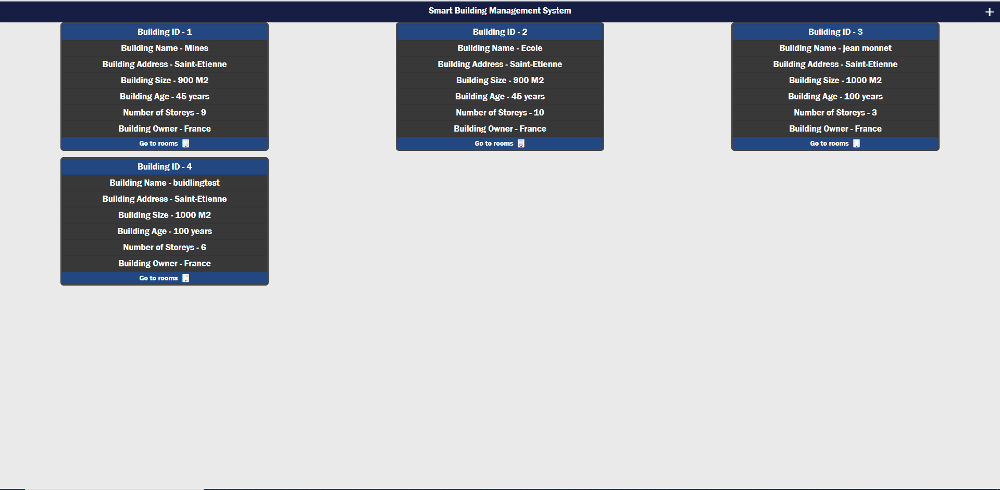

## Navigate to rooms and add new rooms for a selected building 

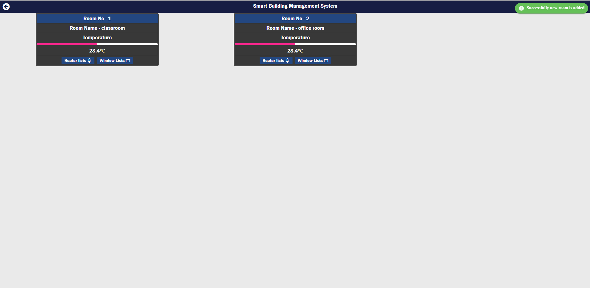

## Add new room dialog box

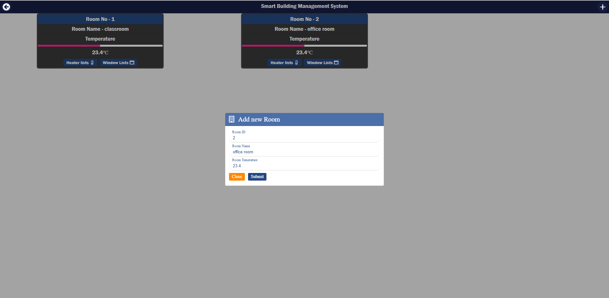

## navigate to heater menu and add new heater and also show the notification when new heater is added 

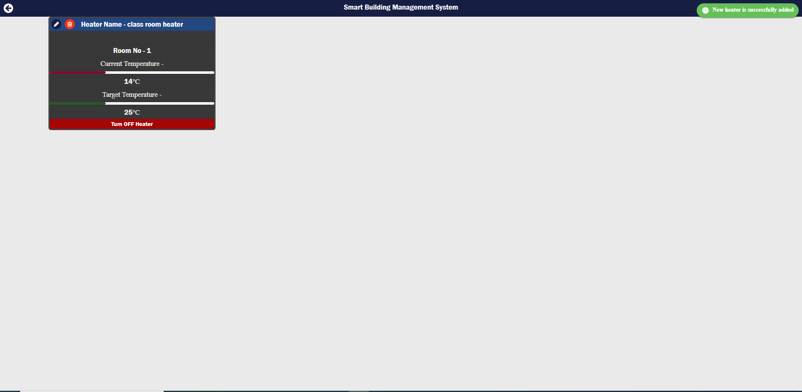

## edit added heater 

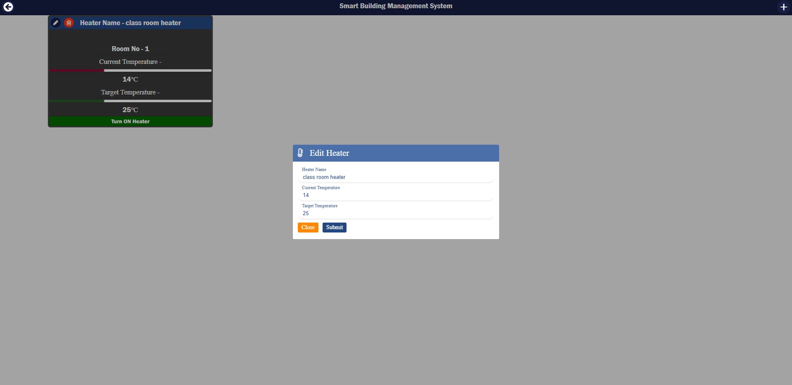

## confirmation dialog box to delete the selected heater

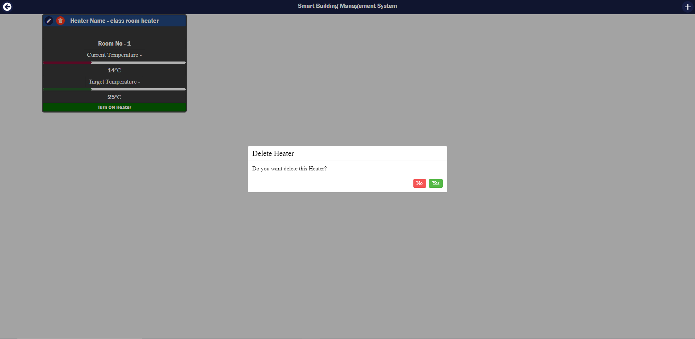

## Confirmation dialog box to change heater status

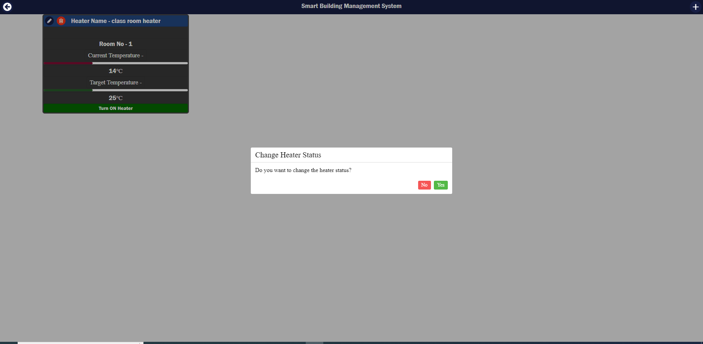

## Dialog box to add new window

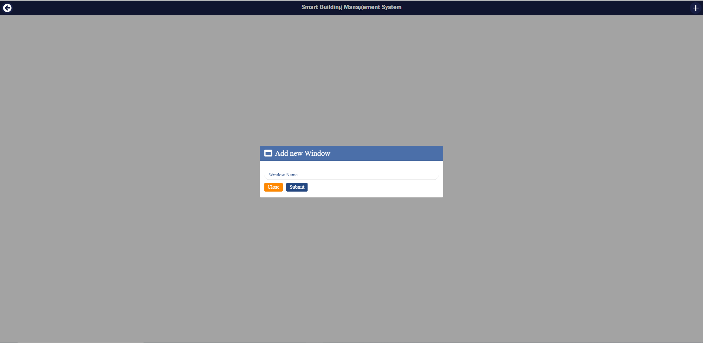

## Display the windows

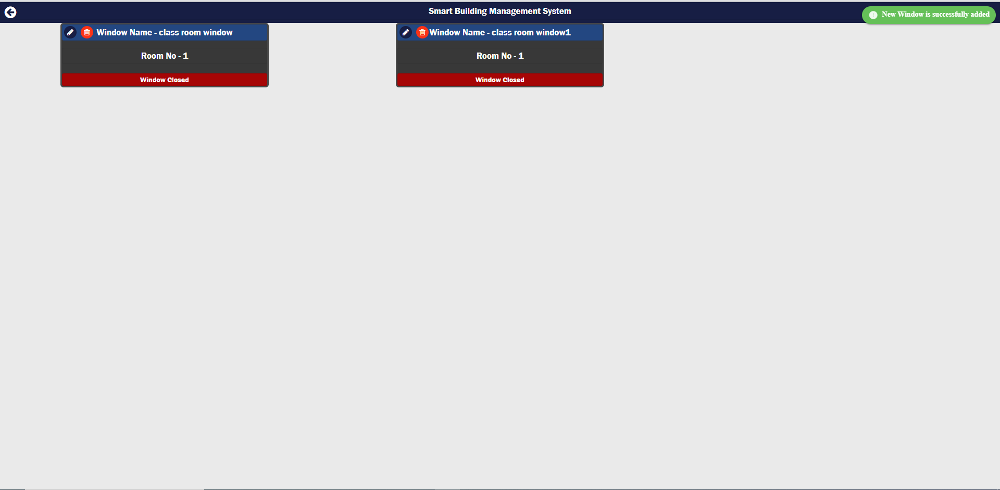

## dialog box to edit windows

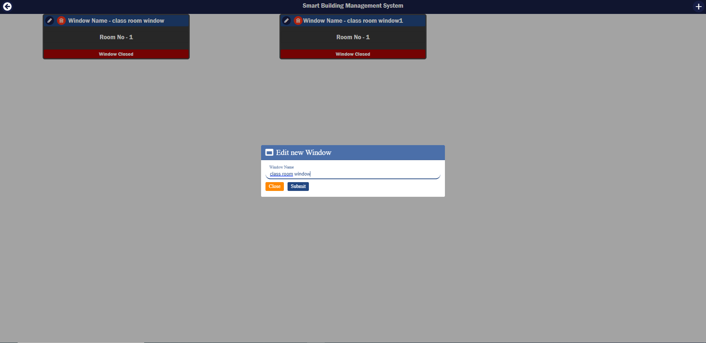
## confirmation dialog box to delete windows 

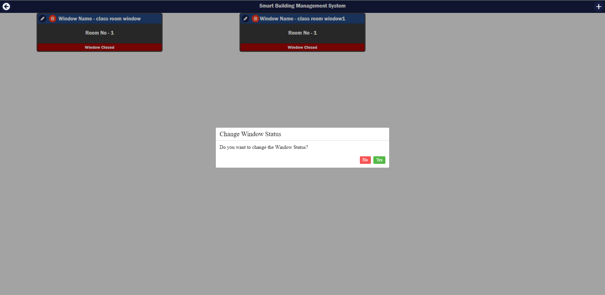
## confirmation dialog box to change window status

More more information about the feature , we requested to see the small vedio demo of the app.

